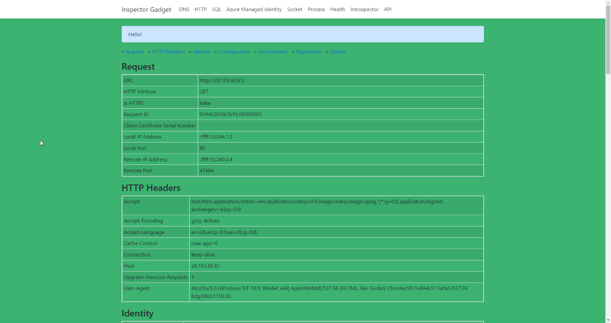

# Service catalog managed application deployment

## Overview

A service catalog managed application is very similar to a marketplace application but it intended to be deployed with an internal organisation application catalog. They share many characteristics and service catalog apps can be a convenient way to test a managed application before publishing to marketplace.

For more details on service catalog managed application see:

* [Azure managed applications overview](https://docs.microsoft.com/azure/azure-resource-manager/managed-applications/overview)
* [Quickstart: Create and publish a managed application definition](https://docs.microsoft.com/azure/azure-resource-manager/managed-applications/publish-service-catalog-app?tabs=azure-cli)

## High level steps for publishing a service catalog managed application

1. Create a template that defines the resources to deploy with the managed application (`bicep/`)
1. Define the user interface elements for the portal when deploying the managed application (`marketplace/createUiDefinition.json`)
1. Create a .zip package that contains the required template files
1. Decide which identities need access to the managed resource group
1. Create the managed application definition from the .zip package and requests access for the identity

## Create a package file for the managed app definition

1. Build the ARM templace from the Bicep files

    ```bash
    az bicep build --file ./bicep/mainTemplate.bicep
    ```

1. Copy the generated `mainTemplate.json` file to the `marketplace` folder
1. cd into the `marketplace` folder
1. Zip both `mainTemplate.json` and `createUiDefinition.json` into a file named `package.zip`

## Upload package to blob storage

1. In order to create a managed app definition, you need to stage the `package.zip`  file at a URL. Blob storage can be used for this.
1. You may either
   1. Use the Azure Portal to
      1. Create a storage account
      1. Create a blob container in the storage account
      1. Upload `marketplace/package.zip` to the container
      1. Generate a SAS URI to provide read access to the blob
   1. Use the script snippets in `helpers/deploy-app-definition.sh` to achieve the same

## Create a managed app definition from the package

1. Use the script snippets in `helpers/deploy-app-definition.sh`

   ```bash
   az managedapp definition create \
   --name "${NAME}" \
   --location "${LOCATION}" \
   --resource-group "${RG}" \
   --lock-level ReadOnly \
   --display-name "${DISPLAY_NAME}" \
   --description "${DESCRIPTION}" \
   --authorizations "${USER_ID}:${OWNER_ROLE_ID}" \
   --package-file-uri "${BLOB_URL}"
   ```

1. If you used the portal to upload package.zip, you will need to populate the above environment variables to match the values you used
1. There are snippets in the file to create `USER_ID`, `OWNER_ROLE_ID`

## Deploy application

1. To deploy the Kubernetes application, **you will need to work in your own copy of this repo**
1. The application is deployed using GitHub actions in a workflow at `/.github/workflows/k8s-deploy-manifest.yml`
1. Navigate to your repo on [GitHub](https://www.github.com)
1. Then go to `Settings` -> `Secrets` -> `Actions`
1. Create the following (action) secrets:
    * `AZURE_CREDENTIALS` (see [this link](https://github.com/marketplace/actions/azure-login#configure-a-service-principal-with-a-secret))
    * `AZURE_SUBSCRIPTION_ID` - the `customer` subscription ID (see outputs: `customerSubscriptionId`)
    * `AZURE_TENANT_ID` - the `customer` tenant ID (see outputs: `customerTenantId`)
    * `CLUSTER_NAME` - the AKS cluster name (set to `aks101cluster-vmss`)
    * `KV_NAME` - the KV name (see outputs: `keyVaultName`)
    * `KV_SECRET_PROVIDER_IDENTITY`(see outputs: `keyVaultSecretProviderManagedIdentity`)
    * `RESOURCE_GROUP_NAME` (see outputs: `customerManagedResourceGroupName`)
1. Before running the workflow, you need to make a minor change to the application manifest
1. In your copy of the repo, open up `/app/deployment/yml` - this is the Kubernetes manifest
1. On line 18, update the image reference to point to your container registry repo

    ```yaml
    image: <acrname>.azurecr.io/inspectorgadget:latest
    ```

1. Make sure you do not change the indentation - this is important in YAML
1. Save, commit and push your changes to GitHub
1. Confirm you can see your changes refected on GitHub
1. Run the `Build and deploy an app to AKS` workflow via the GitHub UI
   1. On GitHub, navigate to `Actions`
   1. Under `Workflows` select `Build and deploy an app to AKS`
   1. Select `Run workflow` and click the `Run workflow` button that appears
1. Click on the workflow run and you can monitor progress
1. When the run completes, click on step `Get external IP` to get the IP address of the application
1. Navigate to the IP address and confirm the inspector gadget home page appears with a coloured background (set by `background-color`) and and info message (set by `info-message`)

  
