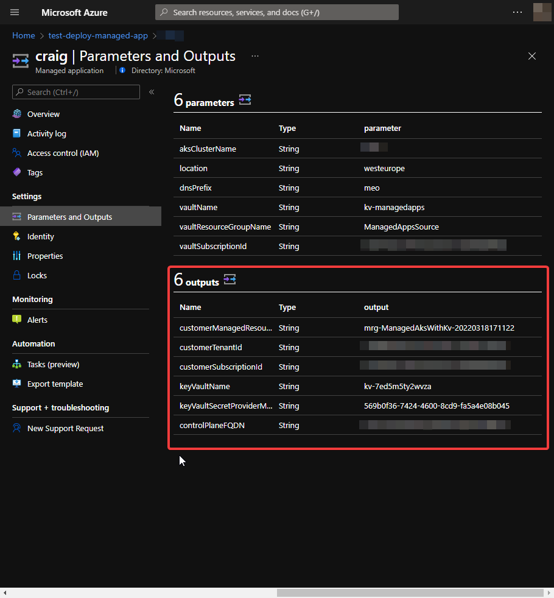

# Service Catalog Managed Application Deployment

## Overview

A service catalog managed application is very similar to a marketplace application but it intended to be deployed with an internal organisation application catalog. They share many characteristics and service catalog apps can be a convenient way to test a managed application before publishing to marketplace.

For more details on service catalog managed application see:

* [Azure managed applications overview](https://docs.microsoft.com/azure/azure-resource-manager/managed-applications/overview)
* [Quickstart: Create and publish a managed application definition](https://docs.microsoft.com/azure/azure-resource-manager/managed-applications/publish-service-catalog-app?tabs=azure-cli)

## High level steps for publishing a service catalog managed application

1. Create a template that defines the resources to deploy with the managed application (`bicep/`)
1. Define the user interface elements for the portal when deploying the managed application (`marketplace/createUiDefinition.json`)
1. Create a .zip package that contains the required template files
1. Decide which identities need access to the managed resource group
1. Create the managed application definition from the .zip package and requests access for the identity

## Create a package file for the managed app definition

1. Build the ARM template from the Bicep files

    ```bash
    az bicep build --file ./bicep/mainTemplate.bicep
    ```

1. Copy `mainTemplate.json` file to the `marketplace` folder
1. cd into the `marketplace` folder
1. You must make a manual edit to the `mainTemplate.json` file at this stage
   1. Open `mainTemplate.json` in an editor such as VS Code
   1. Find the `vaultSubscriptionId` parameter (around line 46)
   1. Set the default value to your Azure `Subscription ID`
      * For a service catalog deployment, the app definition and deployed instance will be in the same subscription
   1. You should end up with something like

      ```json
      "vaultSubscriptionId": {
         "type": "string",
         "defaultValue": "xxxxxxxx-xxxx-xxxx-xxxx-xxxxxxxxxxxx",
         "metadata": {
         "description": "The subscription id of the source key vault."
      }
      ```

   1. Save the changes to `mainTemplate.json`

1. Zip both `mainTemplate.json` and `createUiDefinition.json` into a file named `package.zip`

## Upload package to blob storage

In order to create a managed app definition, you need to stage the `package.zip`  file at a URL.

1. Blob storage can be used to stage the `package.zip` file
1. You may either
   1. Use the Azure Portal to
      1. Create a storage account
      1. Create a blob container in the storage account
      1. Upload `marketplace/package.zip` to the container
      1. Generate a SAS URI to provide read access to the blob
   1. Use the script snippets in `helpers/deploy-app-definition.sh` to achieve the same
1. You just need to get `package.zip` available at an accessible URL

## Create a managed app definition from the package

1. Once you have staged `package.zip` you can create an app definition
1. Use the script snippets in `helpers/deploy-app-definition.sh`

   ```bash
   az managedapp definition create \
   --name "${NAME}" \
   --location "${LOCATION}" \
   --resource-group "${RG}" \
   --lock-level ReadOnly \
   --display-name "${DISPLAY_NAME}" \
   --description "${DESCRIPTION}" \
   --authorizations "${USER_ID}:${OWNER_ROLE_ID}" \
   --package-file-uri "${BLOB_URL}"
   ```

1. If you used the portal to upload package.zip, you will need to populate the above environment variables to match the values you used
1. There are snippets in the file to create `USER_ID`, `OWNER_ROLE_ID`

## Create an instance of your managed application

1. Now you have a managed application definition you can deploy an instance of your managed app
1. This is analogous to
   1. Creating your app definition =>
      * Publishing your application on marketplace
   1. Creating a new instance of your service catalog managed application
      * Customer acquires your application from marketplace
1. In the Azure Portal, navigate to your managed app definition

   

1. Click on `Deploy from definition` and complete the service creation wizard to deploy to your chosen resource group, region etc

## Capture deployment outputs for use in the next step

1. When the deployment completes, in the Azure Portal, navigate to the resource group where the application was deployed
1. Navigate to the Managed Application resource
1. Navigate to the `Parameters and Outputs` blade on the left hand menu (under `Settings`)
1. Your outputs should look something like this

   

1. Either leave the tab open or capture the outputs somewhere for the next stage

## Deploy application

[Continure to Application Deployment](./deploy-app.md)
