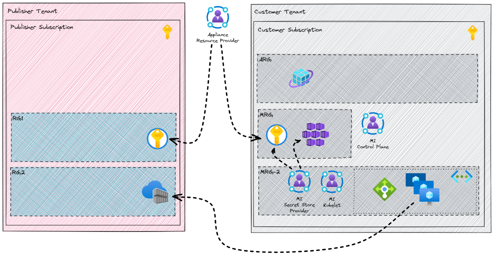
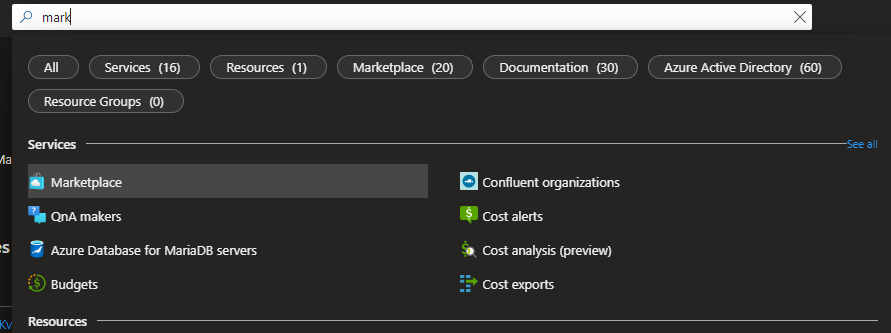
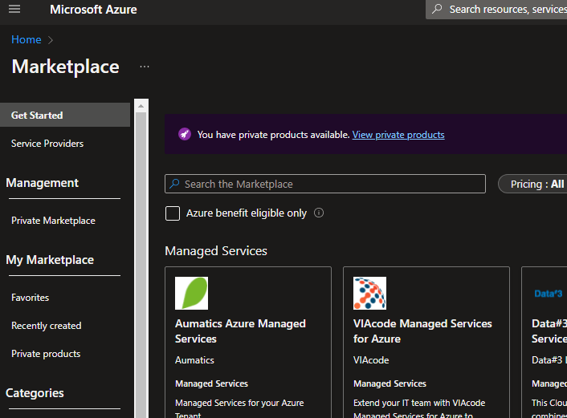

# Marketplace Managed Application Deployment

## Overview

A marketplace managed application is intended to be deployed into a customer subscription with delegated administration rights for the publisher. The customer typically has very limited access to the deployed resources. In the case of an AKS deployment, some of the deployed resources are accessible to the customer. For more details see [Usage of Azure Kubernetes Service (AKS) and containers in managed applications](https://docs.microsoft.com/azure/marketplace/plan-azure-app-managed-app#usage-of-azure-kubernetes-service-aks-and-containers-in-managed-application)

The diagram shows the resources involved in a marketplace deployment of this solution and some of the data flows and identities. Note that resource group **ARG** is restrictred to the **customer** by RBAC permissions, **MRG** is restriced to the **publisher** and **MRG-2** can (potentially) be accessed by **both**.



For more details on marketplace managed application see:

* [Azure managed applications overview](https://docs.microsoft.com/azure/azure-resource-manager/managed-applications/overview)
* [Plan an Azure Application offer for the commercial marketplace | Microsoft Docs](https://docs.microsoft.com/azure/marketplace/plan-azure-application-offer)

## High level steps for publishing a marketplace managed application

This is very similar to the steps for publishing a catalog managed application.

1. Create a template that defines the resources to deploy with the managed application (`bicep/`)
1. Define the user interface elements for the portal when deploying the managed application (`marketplace/createUiDefinition.json`)
1. Create a .zip package that contains the required template files
1. Decide which identities need access to the managed resource group
1. Create a new **Azure application offer** in Partner Center
1. Create a managed application plan within the offer, upload the package, define the identities to manage the deployments etc

## Create a package file for the managed app definition

1. Build the ARM template from the Bicep files

    ```bash
    az bicep build --file ./bicep/mainTemplate.bicep
    ```

1. Copy `mainTemplate.json` file to the `marketplace` folder
1. cd into the `marketplace` folder
1. Zip both `mainTemplate.json` and `createUiDefinition.json` into a file named `package.zip`

## Publish your managed application in Partner Center

* This involves a number of steps common to publishing any application in Partner Center
* Rather than recreating these here, follow the steps in the link below **with one minor change**
  * **Preview Audience**
    * Whilst you *can* publish and managed your app from the same subscription it is not representative of the marketplace cross-tenant scenario
    * Ideally you should have access to two subscriptions backed by two different AAD tenants
    * Enter **both** subscription IDs in the preview audience step
* [Follow the steps in this managed application lab to publish](https://www.azurecitadel.com/marketplace/azureappma/ma-publish/)

## Create an instance of your managed application

* In you "customer" subscription
* From the home page of the Azure Portal, type "marketplace" in the search box and select the "Marketplace" service

   

* In the left hand menu, select `Private products` under `My Marketplace`

   

* You should be able to see a listing for your new offer (marked as preview)
* Click on the offer
* Select the appropriate plan
* Click on create to start the creation experience
* Complete the details
* Select `Review + create` and address any issues
* Agree to the terms and conditions
* Select `Create`

## Capture deployment outputs for use in the next step

1. When the deployment completes, in the Azure Portal, navigate to the `Outputs` blade
1. Either leave the tab open or capture the outputs somewhere for the next stage

## Deploy application

[Continue to Application Deployment](./deploy-app.md)
